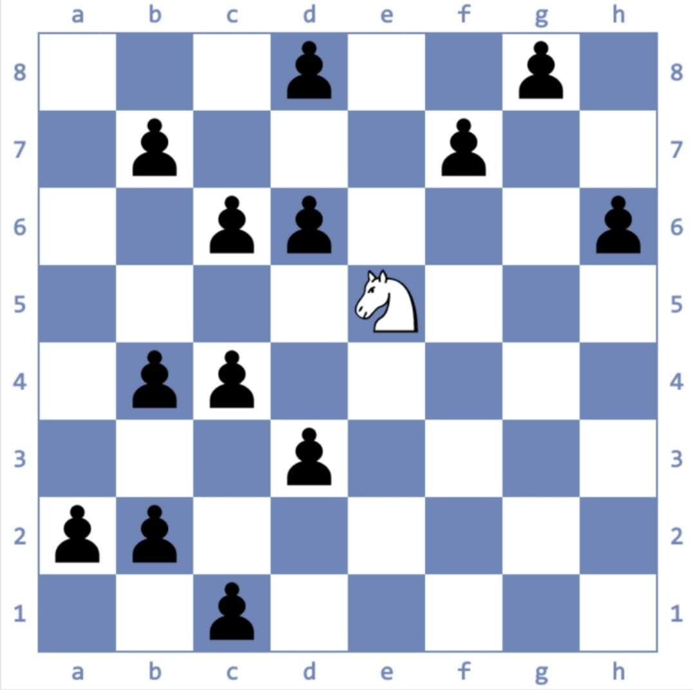
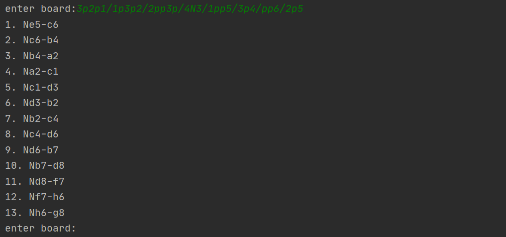

# jumpKnight_route
1. employed dfs to solve the typical problem: with one white knight and several black pawns on board, calculate the appropriate route so that the white knight finishes one of the pawns every single move and ultimately finishes all.

2. for example, to find a possible route like below:
  

  simply run

  ```bash
  $ git clone https://github.com/RidiculousDoge/JumpKnight-chess.git
  $ cd JumpKnight-chess
  $ python dfs_jump.py
  ```

  and enter the board info into the program：

  

  and the program suggests the possible route.

  **note that in this python-chess library, the board is expressed as  ‘8/8/8/8/8/8/8/8’. In example situation, the board is expressed as ‘3p2p1/1p3p2/2pp3p/4N3/1pp5/3p4/pp6/2p5’, for ‘p’ stands for black pawn and ‘N’ stands for white knight. The first slash ‘3p2p1/’ stands for line 8 while the last stands for line 1.**

3. employ python-chess library,to install which simply
  apply
   ```cmd
   pip install python-chess
   ```

4. other functions will be added.
